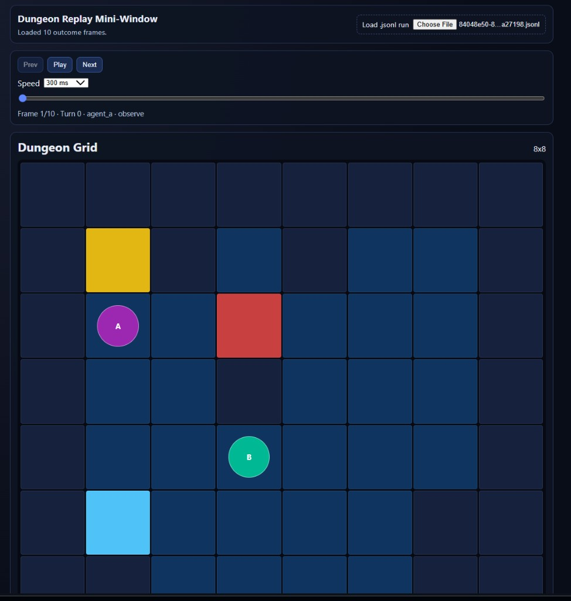

# dungeonAgents-ProveAI

> Two LLM-powered agents navigate an 8×8 dungeon. The goal isn't to win — it's to **prove** what happened and why. Every decision is traced, every epistemic gap is measured, and every failure is made legible to a human diagnoser.

---

## What Is This Project?

**dungeonAgents-ProveAI** is a multi-agent simulation built to explore observability and explainability in agentic AI systems. Two agents operate inside a dungeon grid, subject to fog-of-war and communication lag, while a full observability stack captures every tool call, LLM input/output, and state transition.

The primary deliverable is **not** agent intelligence — it is the quality of traces and the legibility of the diagnostic output. A human reviewer should be able to look at any failed run and answer:

1. **What happened?**
2. **Why did it happen?**
3. **What should change next time?**

---

## Tech Stack

| Layer | Tool |
|---|---|
| Language | Python 3.12+ |
| Agent Framework | LangGraph |
| LLM Providers | OpenAI (gpt-4o-mini, gpt-4o) **and** Google Gemini (gemini-2.0-flash, gemini-1.5-pro) |
| Observability | Langfuse + OpenTelemetry (OTel) |
| State & Validation | Pydantic V2 |
| Legibility UI | Streamlit |
| Live grid UI | React (Vite) + local HTTP helper for in-progress runs |
| Event Storage | Immutable `.jsonl` flat files |

---

## Prerequisites

- **Python 3.12 or higher** — verify with `python --version`
- **pip** — comes bundled with Python
- An API key for at least one LLM provider:
  - **Google Gemini** (recommended): get a free key at https://aistudio.google.com/app/apikey
  - **OpenAI**: get a key at https://platform.openai.com/api-keys
- (Optional) **Langfuse** account for trace storage: https://cloud.langfuse.com

---

## Setup

### 1. Clone the repository

```bash
git clone https://github.com/Qrytics/dungeonAgents-ProveAI.git
cd dungeonAgents-ProveAI
```

### 2. Create and activate a virtual environment

**macOS / Linux:**
```bash
python -m venv .venv
source .venv/bin/activate
```

**Windows PowerShell:**
```powershell
python -m venv .venv
.venv\Scripts\Activate.ps1
```

### 3. Install dependencies

```bash
pip install -e .
```

> This installs the project in editable mode along with all runtime dependencies
> including `langchain-google-genai` (Gemini) and `langchain-openai`.

### 4. Configure environment variables

Copy the example file and fill in your keys:

```bash
cp .env.example .env
```

Then open `.env` and set the values.  You only need the key for the provider you intend to use.

**Minimal setup for Gemini (recommended):**
```
GOOGLE_API_KEY=your_google_api_key_here
AGENT_LLM_MODEL=gemini-2.0-flash

LANGFUSE_PUBLIC_KEY=your_langfuse_public_key
LANGFUSE_SECRET_KEY=your_langfuse_secret_key
LANGFUSE_HOST=https://cloud.langfuse.com
```

**Minimal setup for OpenAI:**
```
OPENAI_API_KEY=your_openai_key_here
AGENT_LLM_MODEL=gpt-4o-mini

LANGFUSE_PUBLIC_KEY=your_langfuse_public_key
LANGFUSE_SECRET_KEY=your_langfuse_secret_key
LANGFUSE_HOST=https://cloud.langfuse.com
```

#### Setting variables without a `.env` file (PowerShell)

If you prefer to set variables directly in your shell session:

```powershell
$env:GOOGLE_API_KEY = "your_google_api_key_here"
$env:AGENT_LLM_MODEL = "gemini-2.0-flash"
$env:LANGFUSE_PUBLIC_KEY = "your_langfuse_public_key"
$env:LANGFUSE_SECRET_KEY = "your_langfuse_secret_key"
$env:LANGFUSE_HOST = "https://cloud.langfuse.com"
```

**macOS / Linux (Bash):**
```bash
export GOOGLE_API_KEY="your_google_api_key_here"
export AGENT_LLM_MODEL="gemini-2.0-flash"
export LANGFUSE_PUBLIC_KEY="your_langfuse_public_key"
export LANGFUSE_SECRET_KEY="your_langfuse_secret_key"
export LANGFUSE_HOST="https://cloud.langfuse.com"
```

#### LLM provider selection

The project auto-selects the right LangChain integration based on the model name set in `AGENT_LLM_MODEL`:

| `AGENT_LLM_MODEL` value | Provider used | Key needed |
|---|---|---|
| `gemini-2.0-flash` | Google Gemini | `GOOGLE_API_KEY` |
| `gemini-1.5-pro` | Google Gemini | `GOOGLE_API_KEY` |
| `gpt-4o-mini` | OpenAI | `OPENAI_API_KEY` |
| `gpt-4o` | OpenAI | `OPENAI_API_KEY` |

Any model name starting with `gemini-` routes to Gemini; everything else routes to OpenAI.

---

## Running the Simulation

The simulation is launched from the repository root using the Python module runner.

### Basic run (default 8×8 grid, uses `AGENT_LLM_MODEL` from env)

```bash
python -m apps.simulation.main
```

### Verbose output (prints turn-by-turn narration)

```bash
python -m apps.simulation.main --verbose
```

### Reproducible run with a fixed seed

```bash
python -m apps.simulation.main --seed 42
```

### Larger grid

```bash
python -m apps.simulation.main --rows 12 --cols 12
```

### Specify a model on the command line

```bash
python -m apps.simulation.main --model gemini-2.0-flash
```

> `--model` overrides the `AGENT_LLM_MODEL` environment variable for that single run.

### All CLI options

```
usage: python -m apps.simulation.main [OPTIONS]

Options:
  --rows INT           Grid rows (default: 8, min: 8)
  --cols INT           Grid columns (default: 8, min: 8)
  --seed INT           Random seed for reproducible layout
  --model TEXT         LLM model name (default: reads AGENT_LLM_MODEL env var)
  --runs-dir PATH      Output directory for event logs (default: runs/)
  --verbose            Print turn-by-turn narration to stdout
  --live-viz           Serve the growing run log for the React live dashboard (127.0.0.1)
  --live-viz-port INT  Port for --live-viz (default: 8765)
  --live-viz-open      Open the browser on the live visualizer URL (implies --live-viz)
```

After each run the console prints:
```
Run ID: <uuid>
Result: WIN | TURN_LIMIT | STUCK
Turns: <n>
Event log: runs/<uuid>.jsonl
```

The full event log is saved as a `.jsonl` file under `runs/`.

---

## Running the Legibility Dashboard

The Streamlit dashboard lets you inspect any saved run visually.

```bash
streamlit run apps/legibility/app.py
```

Then open http://localhost:8501 in your browser.  From there you can:

- **Replay** the simulation turn-by-turn (ground truth vs. agent belief side-by-side)
- **Causal graph** — trace failures backward to root cause nodes
- **Gantt timeline** — see concurrent agent activity and idle gaps
- **Belief heatmaps** — spatial view of confidence and epistemic divergence

---

## Running the React Mini-Window (replay and live)

The React app under `apps/visualizer` shows the **ground-truth grid** (walls, key, door, exit, agents **A** / **B**) from each `outcome` line in a run log. You can use it in three ways:

1. **Live while a new simulation runs** — the grid updates as the log grows (recommended when you want to *watch* a run).
2. **Replay after the fact** — load any finished `runs/<run_id>.jsonl` from disk.
3. **Bundled demo** — no API keys or simulation required; click **Load bundled demo** in the UI.

### What it looks like

This is a real capture of the UI after loading a run (your layout may differ slightly):



### One-time setup (Node.js)

```bash
cd apps/visualizer
npm install
npm run dev
```

Leave this terminal open. Open the URL Vite prints (usually http://localhost:5173).

### A. Live dashboard during a new run (watch the game play out)

You need **two terminals**: one for the React dev server (above), one for the simulation.

1. Start the visualizer: `cd apps/visualizer && npm run dev`
2. From the **repository root**, run the simulation with the live helper:

```bash
python -m apps.simulation.main --live-viz
```

Or add `--live-viz-open` to try to open your browser on the right URL automatically.

The CLI prints a link of the form:

`http://localhost:5173/?run=<run_uuid>&live=1`

Open that link (or refresh if you already had the tab open). The page **polls** the log file while Python writes it, so new moves appear without reloading. Use **Follow latest frame** (on by default) to keep the scrubber on the newest state; turn it off if you want to scrub backward while the run is still going.

**How it works:** `--live-viz` starts a small HTTP server on `127.0.0.1:8765` that exposes `GET /api/runs/<run_id>/raw`. The Vite dev server proxies `/api` to that port (see `apps/visualizer/vite.config.ts`). The browser repeatedly fetches the full log and reparses `outcome` events — simple and robust for typical run sizes.

**If Vite uses another port**, either open the printed URL and fix the origin, or set `LIVE_VIZ_URL` before running Python so the printed link matches your dev server, for example:

```bash
# Bash — Vite on 5174
export LIVE_VIZ_URL=http://localhost:5174
python -m apps.simulation.main --live-viz
```

```powershell
# PowerShell
$env:LIVE_VIZ_URL = "http://localhost:5174"
python -m apps.simulation.main --live-viz
```

**If you change the Python API port**, pass `--live-viz-port <port>` and update the Vite proxy `target` in `vite.config.ts` to match (or set `VITE_LIVE_API_BASE_URL=http://127.0.0.1:<port>` when building/serving the frontend so fetches go directly to Python).

### B. Replay a saved run (file picker)

With `npm run dev` running, click **Load .jsonl run** and choose any file under `runs/` (or elsewhere). Playback controls scrub through **outcome** events in file order (so both agents’ steps within the same turn appear as separate frames).

### C. Try it without running the simulation

Click **Load bundled demo** in the UI. The sample file lives at `apps/visualizer/public/sample_visualizer_demo.jsonl`. To regenerate it from a deterministic grid walk:

```bash
python scripts/generate_sample_visualizer_demo.py
```

(Requires `PYTHONPATH` set to the repo root, or run from an environment where `pip install -e .` was used.)

### Features

- **Live** polling for in-progress runs (`?run=…&live=1`)
- **Replay**: play / pause, prev / next, speed, scrubber
- **Sound** (optional): short Web Audio cues per tool (`move`, `observe`, `interact`, `communicate`); toggle **Sound effects** in the control bar (preference is saved in `localStorage`). If you hear nothing until you click **Play** or the scrubber, that is normal browser autoplay policy.
- Grid cells: wall, floor, key, locked door, exit; agent tokens **A** / **B**
- Run metadata and outcome text under the grid

---

## Running the Tests

All tests use **pytest** and require no API keys — they mock LLM calls.

### Run the full test suite

```bash
pytest
```

### Run a specific test module

```bash
pytest tests/test_environment/test_grid.py
pytest tests/test_environment/test_perception.py
pytest tests/test_agents/test_tools.py
pytest tests/test_legibility/test_divergence.py
```

### Run with verbose output

```bash
pytest -v
```

### Run only tests matching a keyword

```bash
pytest -k "grid"
```

---

## Simulation Rules (Ground Truth)

- **Grid:** 8×8 minimum, with walls, a key, a locked door, and an exit.
- **Agents:** Two agents with randomized starting positions.
- **Fog of War:** Each agent sees only its immediately adjacent cells.
- **Turn Mechanics:** Agents act one at a time; each turn = one tool call.
- **Communication Lag:** Messages sent on Turn N are delivered on Turn N+1.
- **Win Condition:** Both agents reach the exit; one must carry the key to unlock the door.
- **Termination:** Game ends on win, turn-limit hit, or both agents stuck.

---

## File Architecture

```
dungeonAgents-ProveAI/
│
├── README.md                       # This file — project overview & architecture
│
├── docs/                           # Reference documents & research
│   ├── dungeon_agents_v3.pdf       # Original assignment specification
│   ├── GEMINI_DP.pdf               # Gemini Deep Research architectural report
│   ├── GROUND_TRUTH.md             # Extracted hard requirements & deliverables
│   ├── project_logs.md             # Workflow phases & process log
│   ├── PRD.md                      # Product Requirements Document
│   └── repo_arch.md                # Canonical file architecture reference (with env docs)
│
├── apps/
│   │
│   ├── simulation/                 # Core dungeon simulation engine
│   │   ├── main.py                 # Entry point — boots the simulation
│   │   ├── live_viz_server.py      # 127.0.0.1 HTTP helper for React live polling
│   │   │
│   │   ├── environment/            # The dungeon world (source of truth)
│   │   │   ├── grid.py             # Grid state machine; cell types & layout
│   │   │   ├── perception.py       # Fog-of-war engine; viewport masking per agent
│   │   │   ├── interaction.py      # Validates move, pick-up, and unlock actions
│   │   │   └── orchestrator.py     # Environment Orchestrator / Dungeon Master logic
│   │   │
│   │   ├── agents/                 # LLM agent definitions
│   │   │   ├── llm_factory.py      # Provider-agnostic LLM factory (OpenAI & Gemini)
│   │   │   ├── agent_a.py          # Agent A — LangGraph node definition
│   │   │   ├── agent_b.py          # Agent B — LangGraph node definition
│   │   │   ├── dungeon_master.py   # DM agent — operates on stale state (N-2 turns)
│   │   │   ├── tools.py            # Agent tools: move, observe, interact, communicate
│   │   │   └── state.py            # Agent belief state & internal world model
│   │   │
│   │   ├── game_loop/              # Turn-based execution orchestration
│   │   │   ├── loop.py             # Main game loop; gathers intentions, applies transitions
│   │   │   └── message_queue.py    # Communication queue enforcing turn-N+1 delivery lag
│   │   │
│   │   └── schemas/                # Pydantic V2 event & state schemas
│   │       ├── events.py           # Structured event record logged at each agent step
│   │       └── state.py            # World state, agent state, and perception schemas
│   │
│   ├── visualizer/                 # React + Vite live/replay grid UI
│   │   ├── public/                 # Static assets (e.g. sample_visualizer_demo.jsonl)
│   │   └── src/                    # App, grid, JSONL parser, live API client
│   │
│   └── legibility/                 # Streamlit diagnostic dashboard (Legibility Layer)
│       ├── app.py                  # Streamlit app entry point
│       │
│       ├── views/                  # Individual dashboard view components
│       │   ├── replay.py           # Dual-perspective replay: ground truth vs. agent belief
│       │   ├── causal_graph.py     # Causal graph tracing failures back to root cause
│       │   ├── timeline.py         # Gantt-style timeline of concurrent agent activity
│       │   └── heatmaps.py         # Belief confidence & epistemic divergence heatmaps
│       │
│       └── analysis/               # Automated analysis & report generation
│           ├── divergence.py       # Epistemic divergence metric (belief vs. reality gap)
│           └── report.py           # Causal Incident Report generator for failed runs
│
├── packages/
│   │
│   ├── observability/              # Shared observability & tracing package
│   │   ├── tracer.py               # OpenTelemetry + Langfuse SDK integration & setup
│   │   ├── spans.py                # Span definitions: perception, reasoning, action spans
│   │   └── metrics.py              # Custom metrics: divergence_score, token usage, latency
│   │
│   └── shared/                     # Shared utilities used across apps
│       ├── types.py                # Common type definitions (Cell, Position, AgentID, etc.)
│       └── constants.py            # Project-wide constants (grid size, turn limit, etc.)
│
├── runs/                           # Exported simulation run data (structured JSON)
│   └── .gitkeep                    # Placeholder; runs are saved here as .jsonl files
│
├── scripts/                        # Small maintenance utilities
│   └── generate_sample_visualizer_demo.py  # Writes bundled React demo JSONL
│
├── traces/                         # Exported Langfuse / OTel traces
│   └── .gitkeep                    # Placeholder; exported traces are stored here
│
├── configs/                        # External service configuration
│   ├── langfuse.yaml               # Langfuse project & endpoint configuration
│   └── otel.yaml                   # OpenTelemetry collector & exporter configuration
│
├── tests/                          # Test suite
│   ├── test_environment/
│   │   ├── test_grid.py            # Unit tests for grid state machine
│   │   └── test_perception.py      # Unit tests for fog-of-war / viewport masking
│   ├── test_agents/
│   │   └── test_tools.py           # Unit tests for agent tools & validators
│   └── test_legibility/
│       └── test_divergence.py      # Unit tests for divergence metric calculations
│
├── .env.example                    # Template for required environment variables
├── .gitignore                      # Git ignore rules
├── pyproject.toml                  # Python project metadata & dependency management
└── requirements.txt                # Pinned runtime dependencies
```

---

## Key Concepts

### Event Sourcing for Autonomous Agents (ESAA)
Agents do not write directly to the simulation state. They emit **Intentions** (e.g., "move North"), which are validated by the Orchestrator and appended to an immutable event log (`runs.jsonl`). The current board state is always a projection of this log. This enables **Deterministic Replay** — any failed run can be re-executed from any turn.

### Epistemic Divergence
The core diagnostic metric. Measures the gap between an agent's internal belief about the world and the actual ground truth at any given turn. Spikes in this metric pinpoint the exact turn where a communication failure or missed observation occurred.

### The Legibility Layer
A Streamlit dashboard that transforms raw JSON traces into human-interpretable visualizations:
- **Dual-Perspective Replay** — ground truth vs. agent subjective map side-by-side.
- **Causal Graph** — traces failures backward to root cause nodes.
- **Gantt Timeline** — shows concurrent agent activity and idle gaps.
- **Belief Heatmaps** — maps confidence and divergence over the grid spatially.

### Observability Stack
Every agent turn generates a parent OTel trace with child spans for: Perception → Reasoning → Action. Key metadata attributes (`belief_coordinates`, `divergence_score`, `tool_name`, `latency`) are logged to Langfuse for filtering and cross-run comparison.

---

## Deliverables

- [ ] Full source code in this repository with continuous commit history
- [ ] Exported Langfuse traces (stored in `traces/`)
- [ ] Multiple simulation runs as structured JSON — successes and failures (stored in `runs/`)
- [ ] Full AI conversation/coding tool history
- [ ] 1–3 minute Loom video walkthrough of decisions and design rationale

